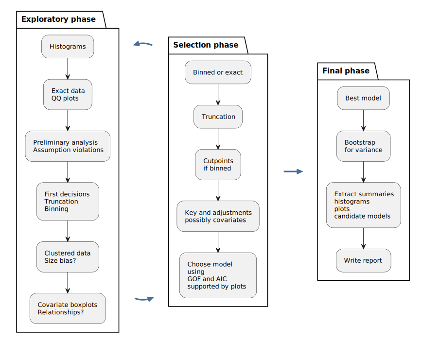

```{r setup, include=FALSE}
knitr::opts_chunk$set(echo = TRUE)
```

# Your skills as a distance sampling analyst `r knitr::asis_output("\U1F575")`

As promised, if you wish to perform a distance sampling analysis upon a data set, I have one for you to download.  It is a bit of a scrappy data set, not very many line transects (12), not very many detections (43).  As such, it might present a couple of challenges to you, but hopefully not too many.  

- There was one covariate recorded `r knitr::asis_output("\U270D")` with each detection--whether the animal was male or female .
- Units of measure `r knitr::asis_output("\U1F4CF")`  are: perpendicular distances in meters, effort (transect lengths) in kilometers and area of study region in square kilometers.

Don't forget to set the units properly

```{r, message=FALSE, warning=FALSE}
library(Distance)
conversion <- convert_units("meter", "kilometer", "square kilometer")
```

Remember some of the hints I have provided (in decision sequence above) along with decisions you will need to make regarding truncation.

Do a competent job with your analysis and we will share our findings (preferred model, point estimate of abundance and precision of abundance estimate) on Thursday during the practical session.

The data set (in CSV format) is available in the file space of this project, shown in the File panel, named **mystery.csv**.

This will be your first adventure looking at data that is not contained within the `Distance` package.  Therefore, your first analysis task will be to read the data from the `.csv` file into R for subsequent analysis.  Example code below:

```{r, eval=FALSE}
mydata <- read.csv("mystery.csv")
```

What happens after this is up to you.

## `r knitr::asis_output("\U1F974      \U1F914")`


```{r, out.width="100%", echo=FALSE, fig.cap="Three stages of distance sampling analysis."}
